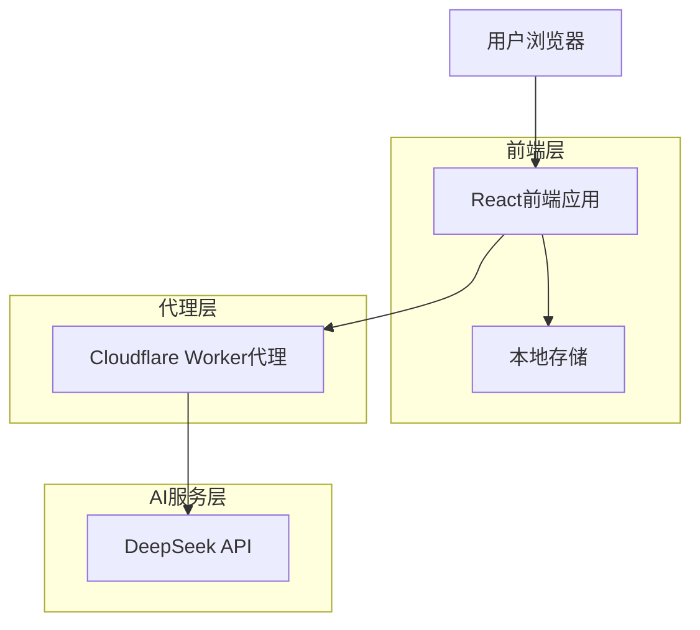

# 技术方案设计

## 架构设计



## 技术选型

- **前端**: React@18 + TypeScript + TailwindCSS + Vite
- **状态管理**: React Hooks + Context API
- **本地存储**: localStorage + 序列化JSON
- **代理服务**: Cloudflare Workers
- **AI服务**: DeepSeek API (通过OpenAI SDK格式)

## 核心组件设计

### 前端组件结构
```
src/
├── components/
│   ├── GameStart/          # 游戏开始界面
│   ├── GameBoard/          # 游戏主界面
│   ├── Graveyard/          # 坟场区域
│   ├── GameStats/          # 游戏统计
│   └── VictoryModal/       # 胜利弹窗
├── hooks/
│   ├── useGameState.ts     # 游戏状态管理
│   ├── useTimer.ts         # 计时器逻辑
│   └── useDeepSeek.ts      # API调用逻辑
├── services/
│   ├── deepseek.ts         # DeepSeek API服务
│   ├── cloudflare.ts       # Cloudflare代理服务
│   └── storage.ts          # 本地存储服务
└── types/
    └── game.types.ts       # 类型定义
```

### API接口设计

#### 词条生成接口
```typescript
POST /api/generate-entry
{
  "category": "自然" | "天文" | "地理" | "动漫" | "影视" | "游戏" | "体育" | "历史" | "ACGN" | "随机"
}

Response:
{
  "entry": "词条名称",
  "content": "百科内容",
  "category": "领域"
}
```

#### 代理服务实现
```javascript
// Cloudflare Worker
addEventListener('fetch', event => {
  event.respondWith(handleRequest(event.request))
})

async function handleRequest(request) {
  const url = new URL(request.url)
  
  if (url.pathname === '/api/generate-entry') {
    const { category } = await request.json()
    
    const prompt = `请生成一个${category}领域的词条名称和对应的百科内容。
    要求：
    1. 词条名称简洁准确
    2. 百科内容100-200字
    3. 内容真实可靠
    4. 返回JSON格式：{"entry": "词条名称", "content": "百科内容"}`
    
    const response = await fetch('https://api.deepseek.com/chat/completions', {
      method: 'POST',
      headers: {
        'Authorization': `Bearer ${DEEPSEEK_API_KEY}`,
        'Content-Type': 'application/json'
      },
      body: JSON.stringify({
        model: 'deepseek-chat',
        messages: [{ role: 'user', content: prompt }],
        response_format: { type: 'json_object' }
      })
    })
    
    return response
  }
  
  return new Response('Not Found', { status: 404 })
}
```

## 数据模型设计

### 游戏状态类型定义
```typescript
interface GameState {
  gameId: string;
  category: string;
  entry: string;
  content: string;
  maskedContent: boolean[];
  revealedIndices: number[];
  graveyard: string[];
  attempts: number;
  startTime: number;
  currentTime: number;
  isActive: boolean;
  isVictory: boolean;
}

interface GameStats {
  totalTime: number;
  totalAttempts: number;
  victory: boolean;
  category: string;
}
```

### 本地存储结构
```typescript
interface SavedGame {
  version: string;
  timestamp: number;
  gameState: GameState;
}
```

## 核心算法实现

### 文字遮盖算法
```typescript
function maskContent(content: string): boolean[] {
  // 为每个字符创建遮盖状态
  // 中文字符遮盖，英文字符和标点符号显示
  return content.split('').map(char => {
    const isChinese = /[\u4e00-\u9fff]/.test(char);
    return isChinese;
  });
}

function revealCharacters(content: string, targetChar: string, masked: boolean[]): boolean[] {
  return masked.map((isMasked, index) => {
    if (!isMasked) return false;
    return content[index] !== targetChar;
  });
}
```

### 胜利判定算法
```typescript
function checkVictory(entry: string, revealedEntry: string): boolean {
  return entry.toLowerCase() === revealedEntry.toLowerCase();
}

function isGameComplete(maskedContent: boolean[]): boolean {
  return maskedContent.every(masked => !masked);
}
```

## 性能优化策略

1. **API缓存**: 在Cloudflare Worker中实现词条缓存，避免重复API调用
2. **本地状态**: 使用React.memo优化组件重渲染
3. **防抖处理**: 用户输入添加防抖，避免频繁状态更新
4. **懒加载**: 按模块拆分代码，实现按需加载

## 错误处理机制

1. **API错误**: 实现重试机制和降级方案（使用预设词条）
2. **网络错误**: 显示友好的错误提示和重试按钮
3. **存储错误**: 降级到内存存储，不影响游戏体验
4. **输入验证**: 客户端和服务端双重验证用户输入

## 安全考虑

1. **API密钥**: 通过Cloudflare Worker代理，避免前端暴露密钥
2. **输入过滤**: 防止XSS攻击，对用户输入进行转义
3. **请求限流**: 在代理层实现请求频率限制
4. **内容过滤**: 对AI生成的内容进行适当过滤

## 测试策略

1. **单元测试**: 核心算法和工具函数
2. **集成测试**: API调用和数据流测试
3. **E2E测试**: 完整游戏流程测试
4. **性能测试**: 加载时间和响应速度测试